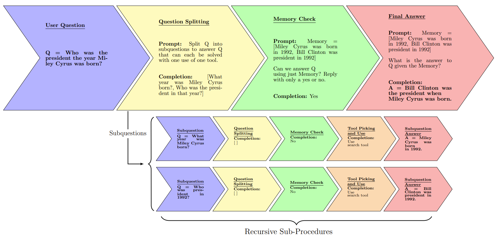

# REBEL

This is the code for the "LLM Guided Inductive Inference for Solving Compositional Problems" paper presented at ICML TEACH23



## Table of Contents
- [Installation](#installation)
- [Requirements](#requirements)
- [Usage](#usage)
- [Background](#background)
- [Evaluation](#evaluation)
- [Authors](#authors)
- [Citation](#citation)
- [References](#references)
- [Contact](#contact)

## Requirements
To run REBEL you need to have a Python version that is greater than 3.8. 

All other requirements that can be installed using the Installation section. 

## Installation
To install REBEL first run

```
git clone https://github.com/anarchy-ai/LLM-VM.git
pip install .
```

From the root LLM-VM directory, we need to go to the REBEL directory.

```
cd .\src\llm_vm\agents\REBEL
```

and then run

```
pip install -r requirements.txt
```

## Usage
After installation is complete there are a few ways that you can run REBEL. 


The first is through the quickstart_REBEL.py in the root LLM_VM directory. 
To run the REBEL agent run 
```
python quickstart_REBEL.py
```
In the quickstart_REBEL.py file it is shown how one can use the LLM-VM client function to declare tools and use the REBEL agent. You can add more tools to the file and change the query REBEL is run on. 


Secondly, you can run REBEL by importing client from llm_vm in the following way:

```
from llm_vm.client import Client
import os

client = Client(big_model='chat_gpt', small_model='gpt')

response = client.complete(
	 prompt = 'Is it warmer in Paris or Timbuktu and what are the temperatures in either city?',
         context='',
         openai_key=os.getenv("OPENAI_API_KEY"), #for REBEL we need an OpenAI key
         tools=[{'description': 'Find the weather at a location and returns it in celcius.',  
                 'dynamic_params': {
		 		   "latitude": 'latitude of as a float',
		 		   "longitude": 'the longitude as a float'
				   },
                 'method': 'GET',
                 'url': "https://api.open-meteo.com/v1/forecast",
                 'static_params': {'current_weather': 'true'}}]) 
print(response)
```
This is identical to how the code in quickstart_REBEL accesses REBEL, but this can be done by any file written in the LLM_VM root directory. Any calls to client.complete that contains a list of tools passed to the parameter "tools" will result in the usage of the REBEL repository. 

To define a tool create a dictionary with the following fields:

|Field| Type | Description|
|-|-|-|
|```'description'```| string | A description of what the tool does|
|```'dynamic_params'```| dictionary | A dictionary containing key value pairs (paramter name : description) of the API endpoint's mutable parameters that need to be set by REBEL in order to answer a query|
|```'method'```| string | ```GET``` or ```POST```, whichever is the type of the API endpoint|
|```'url'```| string | URL of the API endpoint that the given tool specifies|
|```'static_params'```| dictionary | Any parameters that are constant between all API calls. An API key/token is an example of this|


Lastly to run tests on the Compositional Celebrities database run
```
python test_agent.py
```
in the REBEL directory. After running test_agent.py you will see a menu like this:

```
0 birthplace_rounded_lat
1 birthplace_rounded_lng
2 birthplace_tld
3 birthplace_ccn3
4 birthplace_currency
5 birthplace_currency_short
6 birthplace_currency_symbol
7 birthplace_jpn_common_name
8 birthplace_spa_common_name
9 birthplace_rus_common_name
10 birthplace_est_common_name
11 birthplace_urd_common_name
12 birthplace_callingcode
13 birthyear_nobelLiterature
14 birthdate_uspresident
15 birthyear_masterchamp
```
Enter the number of the category you want to test, and then press enter to start the experiment. 
Below we present data on the REBEL agent and its merits. 

## Background

* While large language models (LLMs) have demonstrated impressive performance in question answering tasks, their performance is limited when the questions require knowledge that is not included in the model’s training data and can only be acquired through direct observation or interaction with the real world. 
* Existing methods decompose reasoning tasks through the use of modules invoked sequentially, limiting their ability to answer deep reasoning tasks. 
* We introduce a method, Recursion based extensible LLM (REBEL), which handles open-world, deep reasoning tasks. REBEL allows LLMs to reason via recursive problem decomposition and utilization of external tools. 

## Evaluation

* We tested REBEL on 3 datasets: Compositional Celebrities (Ofir Press, 2022), FEVER (Thorne et al., 2018), and
HotPotQA (Yang et al., 2018). 

* Below is the table depicting the accuracy percentage of the REBEL system versus ReAct on Compositional Celebrities.

| Category    | ReAct | REBEL | 
|-------------|-------------------|------------------|
|Birthplace_Rounded_Lat | 28% | **59%** |
|Birthplace_Currency| 85% | **94%** |
|Birthplace_Currency_Symbol| 35% | **47%** |
|Birthplace_NobelLiterature| 33% | **82%** |
|Birthdat_USPresident| 53% | **90%** |

* Below is the table depicting the accuracy percentage of the REBEL systhem versus ReAct on HotPotQA and FEVER.

| Dataset    | ReAct | REBEL | 
|-------------|-------------------|------------------|
|FEVER | 72% | **78%** |
|HotPotQA| **63%** | 50% |
   
## Authors 

Meet the awesome minds behind REBEL:

- **Abhigya Sodani** - Research Intern at Anarchy and UCLA student
  - GitHub: [abhigya-sodani](https://github.com/abhigya-sodani)
  - LinkedIn: [Abhigya Sodani](https://www.linkedin.com/in/abhigya-sodani-405918160/)

- **Matthew Mirman** - CEO of Anarchy, PhD ETH Zurich
  - GitHub: [Matthew Mirman](https://github.com/mmirman)
  - LinkedIn: [Matthew Mirman](https://www.linkedin.com/in/matthewmirman/)

These talented individuals have brought their expertise and passion to make REBEL a reality. Connect with them and get to know more about their contributions.

## Citation
```
@inproceedings{
  title={LLM Guided Inductive Inference for Solving Compositional Problems},
  author={Abhigya Sodani, Lauren Moos, and Matthew Mirman},
  booktitle={International Conference on Machine Learning (ICML) TEACH Workshop},
  year={2023},
  url={https://drive.google.com/file/d/1Lmc7jXahND43vPRSdjiGadCLHw2U_y1i/view},
}
```

## Contact

Contact abhigya@anarchy.ai for any questions or concerns about REBEL. 
